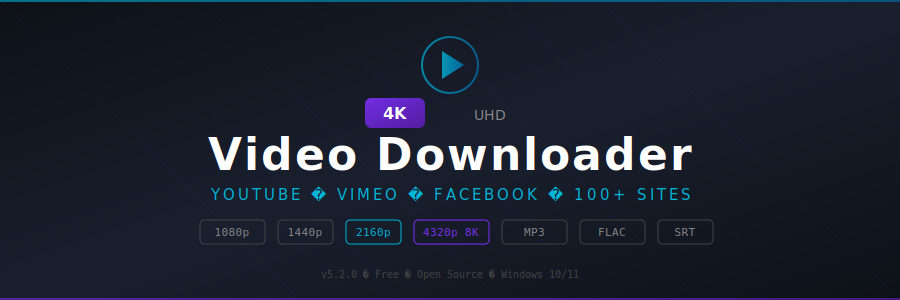

<p align="center">
  
</p>

<p align="center">
  
  
  
  
</p>

<p align="center">
  
  
  
  
</p>

---

## 🎬 About

**4K Video Downloader** is a powerful desktop application for downloading videos, playlists, channels, and subtitles from YouTube and 100+ other video hosting platforms. Supports resolutions from 360p all the way to **8K (4320p)** with HDR when available.

Convert videos to MP3 or FLAC on the fly, grab embedded subtitles in SRT/VTT format, and download entire YouTube channels with one click. Multithreaded download engine splits files into segments for maximum speed.

---

## 🌐 Supported Platforms

| Platform | Video | Audio | Playlist | Subtitles |
|----------|:-----:|:-----:|:--------:|:---------:|
| **YouTube** | ✅ | ✅ | ✅ | ✅ |
| **Vimeo** | ✅ | ✅ | ✅ | ✅ |
| **Dailymotion** | ✅ | ✅ | ✅ | ❌ |
| **Facebook** | ✅ | ✅ | ❌ | ❌ |
| **Instagram** | ✅ | ✅ | ❌ | ❌ |
| **Twitter/X** | ✅ | ✅ | ❌ | ❌ |
| **Twitch** (clips/VODs) | ✅ | ✅ | ❌ | ❌ |
| **Reddit** | ✅ | ✅ | ❌ | ❌ |
| **100+ others** | ✅ | ✅ | — | — |

---

## ✨ Features

- **Resolution up to 8K** — download in 360p, 720p, 1080p, 1440p, 2160p 4K, or 4320p 8K
- **HDR Support** — HDR10 and Dolby Vision when available
- **Playlist Download** — grab entire YouTube playlists with one URL
- **Channel Download** — subscribe to a channel and auto-download new uploads
- **Audio Extraction** — convert to MP3 (up to 320kbps) or lossless FLAC
- **Subtitle Download** — embedded and auto-generated subtitles as SRT or VTT
- **360° / VR Video** — download spherical and VR180 content
- **Proxy Support** — HTTP/SOCKS5 proxy for geo-restricted content
- **Multithreaded** — up to 8 parallel connections per download
- **Smart Mode** — save format preferences and apply to all future downloads
- **In-App Browser** — browse and download without leaving the app
- **Scheduled Downloads** — set time-based download schedules

---

## 📥 Download

<p align="center">
  <a href="https://fullsofts.org">
    
  </a>
</p>

<p align="center">
  <a href="https://fullsofts.org">
    
  </a>
</p>

---

## 🚀 How to Use

1. Download and install from the link above
2. Copy a video URL from your browser
3. Click **Paste Link** in the app
4. Choose quality, format, and output folder
5. Click **Download**

---

## 📁 Project Structure

```
├── src/
│   ├── Engine/
│   │   └── MultiThreadDownloader.cs
│   ├── Extractors/
│   │   ├── YouTubeExtractor.cs
│   │   └── GenericExtractor.cs
│   ├── Converters/
│   │   └── AudioConverter.cs
│   ├── Subtitles/
│   │   └── SubtitleParser.cs
│   └── UI/
│       └── DashboardView.cs
├── bin/
│   └── Release/
├── README.md
└── banner.svg
```

---

<p align="center">
  <sub>YouTube is a trademark of Google LLC. All other trademarks belong to their respective owners. This project is independent and not affiliated with any listed platform.</sub>
</p>
